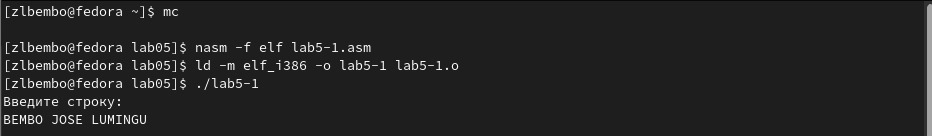
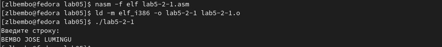

---
## Front matter
title: "Шаблон отчёта по лабораторной работе"
subtitle: "5"
author: "Разанацуа Сара Естэлл"

## Generic otions
lang: ru-RU
toc-title: "Содержание"

## Bibliography
bibliography: bib/cite.bib
csl: pandoc/csl/gost-r-7-0-5-2008-numeric.csl

## Pdf output format
toc: true # Table of contents
toc-depth: 2
lof: true # List of figures
lot: true # List of tables
fontsize: 12pt
linestretch: 1.5
papersize: a4
documentclass: scrreprt
## I18n polyglossia
polyglossia-lang:
  name: russian
  options:
	- spelling=modern
	- babelshorthands=true
polyglossia-otherlangs:
  name: english
## I18n babel
babel-lang: russian
babel-otherlangs: english
## Fonts
mainfont: PT Serif
romanfont: PT Serif
sansfont: PT Sans
monofont: PT Mono
mainfontoptions: Ligatures=TeX
romanfontoptions: Ligatures=TeX
sansfontoptions: Ligatures=TeX,Scale=MatchLowercase
monofontoptions: Scale=MatchLowercase,Scale=0.9
## Biblatex
biblatex: true
biblio-style: "gost-numeric"
biblatexoptions:
  - parentracker=true
  - backend=biber
  - hyperref=auto
  - language=auto
  - autolang=other*
  - citestyle=gost-numeric
## Pandoc-crossref LaTeX customization
figureTitle: "Рис."
tableTitle: "Таблица"
listingTitle: "Листинг"
lofTitle: "Список иллюстраций"
lotTitle: "Список таблиц"
lolTitle: "Листинги"
## Misc options
indent: true
header-includes:
  - \usepackage{indentfirst}
  - \usepackage{float} # keep figures where there are in the text
  - \floatplacement{figure}{H} # keep figures where there are in the text
---

# Цель работы

- Целью данной лабораторной работы является приобретение практических навыков работы в Midnight Commander, освоение инструкций языка ассемблера mov и int.

# Задание

- 1. Основы работы с mc
- 2. Структура программы на языке ассемблера NASM
- 3. Подключение внешнего файла
- 4. Выполнение заданий для самостоятельной работы

# Выполнение лабораторной работы
 
- 1. Основы работы с mc
- Открываю Midnight Commander, введя в терминал mc. (рис. @fig:001).

{#fig:001 width=100%}

- Перехожу в каталог ~/work/study/2022-2023/Архитектура Компьютера/arch-pc, используя файловый менеджер mc. И с помощью функциональной клавиши F7 создаю каталог lab05.(рис. @fig:002).

{#fig:002 width=100%}

- Переходу в созданный каталог. (рис. @fig:003).

{#fig:003 width=100%}

- В строке ввода прописываю команду touch lab5-1.asm, чтобы создать файл, в котором буду работать

- 2. Структура программы на языке ассемблера NASM

- С помощью функциональной клавиши F4 открываю созданный файл для редактирования в редакторе nano.
Ввожу в файл код программы для запроса строки у пользователя (рис. [-@fig:004]). Далее выхожу из файла (Ctrl+X), сохраняя изменения (Y, Enter). (рис. @fig:004).

{#fig:004 width=100%}

- Транслирую текст программы файла в объектный файл командой nasm -f elf lab5-1.asm. Создался объектный файл lab5-1.o. Выполняю компоновку объектного файла с помощью команды ld -m elf_i386 -o lab5-1 lab5-1.o. Создался исполняемый файл lab5-1. И Запускаю исполняемый файл. Программа выводит строку "Введите строку: " и ждет ввода с клавиатуры, я ввожу свои ФИО, на этом программа заканчивает свою работу. (рис. @fig:005).

{#fig:005 width=100%}

- 3. Подключение внешнего файла

- Скачиваю файл in_out.asm со страницы курса в ТУИС. Он сохранился в каталог "Загрузки". С помощью функциональной клавиши F5 копирую файл in_out.asm из каталога Загрузки в созданный каталог lab05
(рис. @fig:006).

{#fig:006 width=100%}

- С помощью функциональной клавиши F5 копирую файл lab5-1 в тот же каталог, но с другим именем, для этого в появившемся окне mc прописываю имя для копии файла. (рис. @fig:007).

{#fig:007 width=100%}

- Изменяю содержимое файла lab5-2.asm во встроенном редакторе nano (рис. [-@fig:008]), чтобы в программе использовались подпрограммы из внешнего файла in_out.asm. (рис. @fig:008).

{#fig:008 width=100%}

- Транслирую текст программы файла в объектный файл командой nasm -f elf lab5-2.asm. Создался объектный файл lab5-2.o. Выполняю компоновку объектного файла с помощью команды ld -m elf_i386 -o lab5-2 lab5-2.o Создался исполняемый файл lab5-2. Запускаю исполняемый файл. (рис. @fig:009).

{#fig:009 width=100%}

- Открываю файл lab5-2.asm для редактирования в nano функциональной клавишей F4. Изменяю в нем подпрограмму sprintLF на sprint. Сохраняю изменения и открываю файл для просмотра, чтобы проверить сохранение действий. (рис. @fig:010).

{#fig:010 width=100%}

- Снова транслирую файл, выполняю компоновку созданного объектного файла, запускаю новый исполняемый файл. (рис. @fig:011).

{#fig:011 width=100%}

- Разница между первым исполняемым файлом lab5-2 и вторым lab5-2-2 в том, что запуск первого запрашивает ввод с новой строки, а программа, которая исполняется при запуске второго, запрашивает ввод без переноса на новую строку, потому что в этом заключается различие между подпрограммами sprintLF и sprint.

- 4. Выполнение заданий для самостоятельной работы

- a) Создаю копию файла lab5-1.asm с именем lab5-1-1.asm с помощью функциональной клавиши. (рис. @fig:012).

{#fig:012 width=100%}

- С помощью функциональной клавиши F4 открываю созданный файл для редактирования. Изменяю программу так, чтобы кроме вывода приглашения и запроса ввода, она выводила вводимую пользователем строку. (рис. @fig:013).

{#fig:013 width=100%}

- b) Создаю объектный файл lab5-1-1.o, отдаю его на обработку компоновщику, получаю исполняемый файл lab5-1-1, запускаю полученный исполняемый файл. Программа запрашивает ввод, ввожу свои ФИО, далее программа выводит введенные мною данные . (рис. @fig:014).

{#fig:014 width=100%}

- c) Создаю копию файла lab5-2.asm с именем lab5-2-1.asm с помощью функциональной клавиши F5. (рис. @fig:015).

{#fig:015 width=100%}

- С помощью функциональной клавиши F4 открываю созданный файл для редактирования. Изменяю программу так, чтобы кроме вывода приглашения и запроса ввода, она выводила вводимую пользователем строку. 
(рис. @fig:016).

{#fig:016 width=100%}

- d) Создаю объектный файл lab5-2-1.o, отдаю его на обработку компоновщику, получаю исполняемый файл lab5-2-1, запускаю полученный исполняемый файл. Программа запрашивает ввод без переноса на новую строку, ввожу свои ФИО, далее программа выводит введенные мною данные. (рис. @fig:017).

{#fig:017 width=100%}

# Выводы

- При выполнении данной лабораторной работы я приобрела практические навыки работы в Midnight Commander, а также освоила инструкции языка ассемблера mov и int.

# Список литературы{.unnumbered}

::: {#refs}
:::
