---
## Front matter
title: "Шаблон отчёта по лабораторной работе"
subtitle: "6"
author: "Разанацуа Сара Естэлл"

## Generic otions
lang: ru-RU
toc-title: "Содержание"

## Bibliography
bibliography: bib/cite.bib
csl: pandoc/csl/gost-r-7-0-5-2008-numeric.csl

## Pdf output format
toc: true # Table of contents
toc-depth: 2
lof: true # List of figures
lot: true # List of tables
fontsize: 12pt
linestretch: 1.5
papersize: a4
documentclass: scrreprt
## I18n polyglossia
polyglossia-lang:
  name: russian
  options:
	- spelling=modern
	- babelshorthands=true
polyglossia-otherlangs:
  name: english
## I18n babel
babel-lang: russian
babel-otherlangs: english
## Fonts
mainfont: PT Serif
romanfont: PT Serif
sansfont: PT Sans
monofont: PT Mono
mainfontoptions: Ligatures=TeX
romanfontoptions: Ligatures=TeX
sansfontoptions: Ligatures=TeX,Scale=MatchLowercase
monofontoptions: Scale=MatchLowercase,Scale=0.9
## Biblatex
biblatex: true
biblio-style: "gost-numeric"
biblatexoptions:
  - parentracker=true
  - backend=biber
  - hyperref=auto
  - language=auto
  - autolang=other*
  - citestyle=gost-numeric
## Pandoc-crossref LaTeX customization
figureTitle: "Рис."
tableTitle: "Таблица"
listingTitle: "Листинг"
lofTitle: "Список иллюстраций"
lotTitle: "Список таблиц"
lolTitle: "Листинги"
## Misc options
indent: true
header-includes:
  - \usepackage{indentfirst}
  - \usepackage{float} # keep figures where there are in the text
  - \floatplacement{figure}{H} # keep figures where there are in the text
---

# Цель работы

- Цель данной лабораторной работы - освоение арифметческих инструкций языка ассемблера NASM..

# Задание

- 1) Символьные и численные данные в NASM
- 2) Выполнение арифметических операций в NASM
- 3) Выполнение заданий для самостоятельной работы

# Выполнение лабораторной работы

- 1) Символьные и численные данные в NASM

- С помощью утилиты mkdir создаю директорию, в которой буду создавать файлы с программами для лабораторной работы №6 (рис. [-@fig:001]). Перехожу в созданный каталог с помощью утилиты cd.(рис. @fig:001).

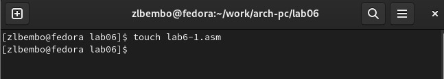{#fig:001 width=100%}

- С помощью утилиты touch создаю файл lab6-1.asm.(рис. @fig:002).

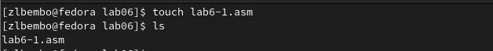{#fig:002 width=100%}

- Копирую в текущий каталог файл in_out.asm с помощью утилиты cp, т.к. он будет использоваться в других программах (рис. @fig:003).

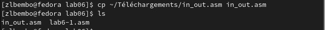{#fig:003 width=100%}

- Открываю созданный файл lab6-1.asm, вставляю в него программу вывода значения регистра eax (рис. @fig:004).

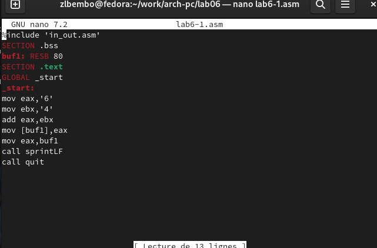{#fig:004 width=100%}

- Создаю исполняемый файл программы и запускаю его (рис. [-@fig:005]). Вывод программы: символ j, потому что программа вывела символ, соответствующий по системе ASCII сумме двоичных кодов символов 4 и 6. (рис. @fig:005).

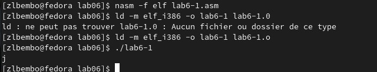{#fig:005 width=100%}

- Изменяю в тексте программы символы "6" и "4" на цифры 6 и 4 (рис. @fig:006).

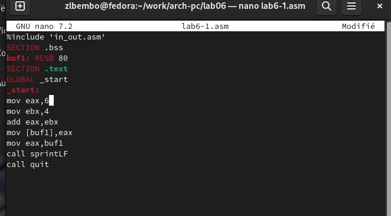{#fig:006 width=100%}

- Создаю новый исполняемый файл программы и запускаю его (рис. [-@fig:007]). Теперь вывелся символ с кодом 10, это символ перевода строки, этот символ не отображается при выводе на экран.(рис. @fig:007).

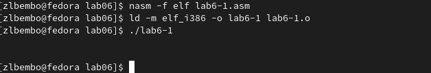{#fig:007 width=100%}

- Создаю новый файл lab6-2.asm с помощью утилиты touch (рис. @fig:008).

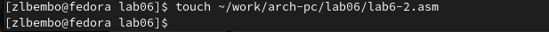{#fig:008 width=100%}

- Ввожу в файл текст другойпрограммы для вывода значения регистра eax (рис. @fig:009).

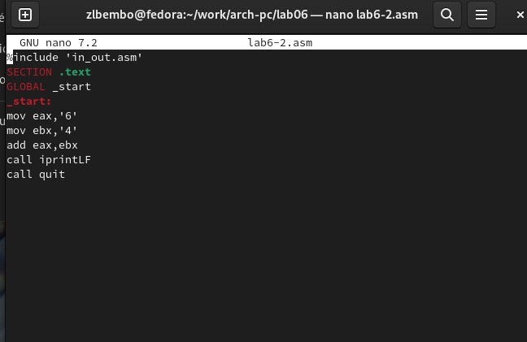{#fig:009 width=100%}

- Создаю и запускаю исполняемый файл lab6-2 (рис. [-@fig:010]). Теперь вывод число 106, потому что программа позволяет вывести именно число, а не символ, хотя все еще происходит именно сложение кодов символов "6" и "4". (рис. @fig:010).

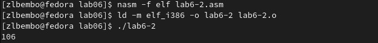{#fig:010 width=100%}

- Заменяю в тексте программы в файле lab6-2.asm символы "6" и "4" на числа 6 и 4 (рис. @fig:011).

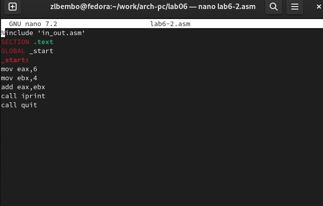{#fig:011 width=100%}

-Создаю и запускаю новый исполняемый файл (рис. [-@fig:012]).. Теперь программа складывает не соответствующие символам коды в системе ASCII, а сами числа, поэтому вывод 10. (рис. @fig:012).

{#fig:012 width=100%}

- Заменяю в тексте программы функцию iprintLF на iprint

- Создаю и запускаю новый исполняемый файл (рис. [-@fig:013]). Вывод не изменился, потому что символ переноса строки не отображался, когда программа исполнялась с функцией iprintLF, а iprint не добавляет к выводу символ переноса строки, в отличие от iprintLF (рис. @fig:013).

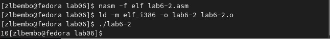{#fig:013 width=100%}

- 2) Выполнение арифметических операций в NASM

- Создаю файл lab6-3.asm с помощью утилиты touch . Ввожу в созданный файл текст программы для вычисления значения выражения f(x) = (5 * 2 + 3)/3 (рис. @fig:014).

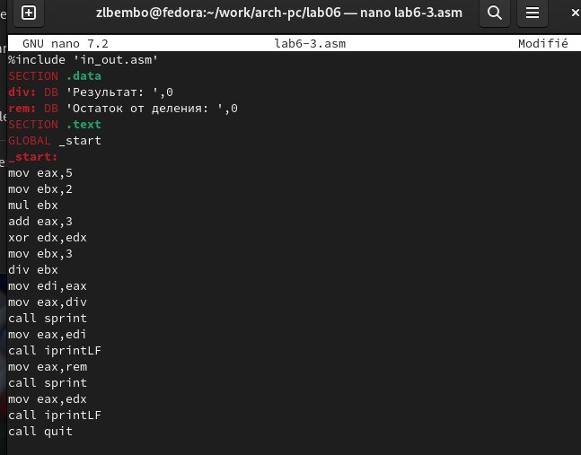{#fig:014 width=100%}

- Создаю исполняемый файл и запускаю его (рис. @fig:015).

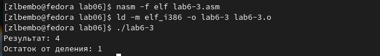{#fig:015 width=100%}

- Изменяю программу так, чтобы она вычисляла значение выражения f(x) = (4 * 6 + 2)/5 (рис. @fig:016).

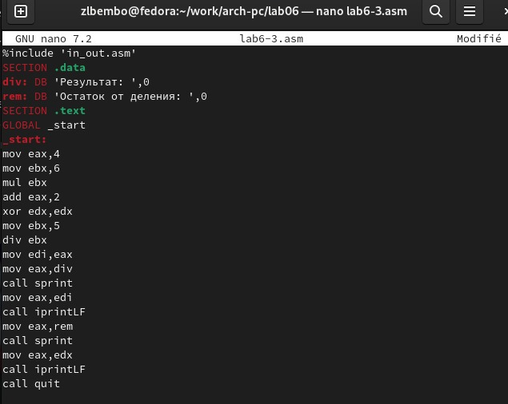{#fig:016 width=100%}

- Создаю и запускаю новый исполняемый файл (рис. [-@fig:017]). Я посчитала для проверки правильности работы программы значение выражения самостоятельно, программа отработала верно. (рис. @fig:017).

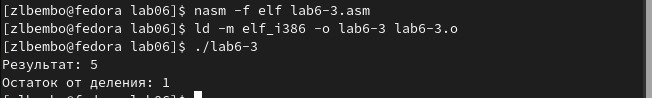{#fig:017 width=100%}

- Создаю файл variant.asm с помощью утилиты touch. (рис. @fig:018).

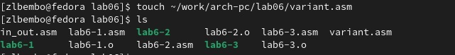{#fig:018 width=100%}

- Ввожу в файл текст программы для вычисления варианта задания по номеру студенческого билета.(рис. @fig:019).

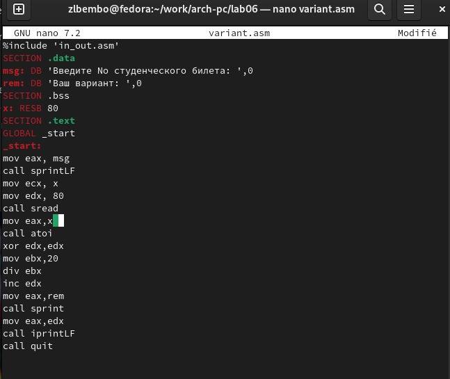{#fig:019 width=100%}

- Создаю и запускаю исполняемый файл (рис. [-@fig:020]). Ввожу номер своего студ. билета с клавиатуры, программа вывела, что мой вариант - 15. рис. @fig:020).

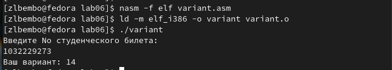{#fig:020 width=100%}

## Ответы на вопросы по программе

- 1) За вывод сообщения "Ваш вариант" отвечают строки кода:
- mov eax,rem
- call sprint

- 2) Инструкция mov ecx, x используется, чтобы положить адрес вводимой строки x в регистр ecx mov edx, 80 - запись в регистр edx длины вводимой строки call sread - вызов подпрограммы из внешнего файла, обеспечивающей ввод сообщения с клавиатуры

- 3) call atoi используется для вызова подпрограммы из внешнего файла, которая преобразует ascii-код символа в целое число и записывает результат в регистр eax

- За вычисления варианта отвечают строки:
- xor edx,edx ; обнуление edx для корректной работы div
- mov ebx,20 ; ebx = 20
- div ebx ; eax = eax/20, edx - остаток от деления
- inc edx ; edx = edx + 1

- 5) При выполнении инструкции div ebx остаток от деления записывается в регистр edx

- 6) Инструкция inc edx увеличивает значение регистра edx на 1

- 7) За вывод на экран результатов вычислений отвечают строки:
- mov eax,edx
- call iprintLF

- 3) Выполнение заданий для самостоятельной работы

- Создаю и запускаю исполняемый файл. рис. @fig:021).

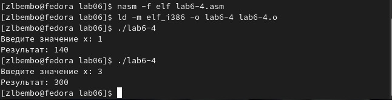{#fig:021 width=100%}

# Выводы

- При выполнении данной лабораторной работы я освоила арифметические инструкции языка ассемблера NASM.

# Список литературы{.unnumbered}

::: {#refs}
:::
