---
## Front matter
title: "Архитектура компьютера"
subtitle: "Отчёт по лабораторной работе №7"
author: "БЕМБО ЖОЗЕ ЛУМИНГУ"

## Generic otions
lang: ru-RU
toc-title: "Содержание"

## Bibliography
bibliography: bib/cite.bib
csl: pandoc/csl/gost-r-7-0-5-2008-numeric.csl

## Pdf output format
toc: true # Table of contents
toc-depth: 2
lof: true # List of figures
lot: true # List of tables
fontsize: 12pt
linestretch: 1.5
papersize: a4
documentclass: scrreprt
## I18n polyglossia
polyglossia-lang:
  name: russian
  options:
	- spelling=modern
	- babelshorthands=true
polyglossia-otherlangs:
  name: english
## I18n babel
babel-lang: russian
babel-otherlangs: english
## Fonts
mainfont: PT Serif
romanfont: PT Serif
sansfont: PT Sans
monofont: PT Mono
mainfontoptions: Ligatures=TeX
romanfontoptions: Ligatures=TeX
sansfontoptions: Ligatures=TeX,Scale=MatchLowercase
monofontoptions: Scale=MatchLowercase,Scale=0.9
## Biblatex
biblatex: true
biblio-style: "gost-numeric"
biblatexoptions:
  - parentracker=true
  - backend=biber
  - hyperref=auto
  - language=auto
  - autolang=other*
  - citestyle=gost-numeric
## Pandoc-crossref LaTeX customization
figureTitle: "Рис."
tableTitle: "Таблица"
listingTitle: "Листинг"
lofTitle: "Список иллюстраций"
lotTitle: "Список таблиц"
lolTitle: "Листинги"
## Misc options
indent: true
header-includes:
  - \usepackage{indentfirst}
  - \usepackage{float} # keep figures where there are in the text
  - \floatplacement{figure}{H} # keep figures where there are in the text
---

# Цель работы

Изучить команды условного и безусловного переходов. Приобрести навыки написания программ с использованием переходов. Познакомиться с назначением и структурой файла листинга.

# Задание

1. Создайте каталог для программам лабораторной работы № 7, перейдите в него и создайте файл lab7-1.asm
2. Инструкция jmp в NASM используется для реализации безусловных переходов. Рассмотрим пример программы с использованием инструкции jmp. Введите в файл lab7-1.asm текст программы из листинга 7.1.
3. Использование инструкции jmp приводит к переходу в любом случае. Однако, часто при написании программ необходимо использовать условные переходы, т.е. переход должен происходить если выполнено какое-либо условие. В качестве примера рассмотрим программу, которая определяет и выводит на экран наибольшую из 3 целочисленных переменных: A,B и C. Значения для A и C задаются в программе, значение B вводиться с клавиатуры.
4. Обычно nasm создаёт в результате ассемблирования только объектный файл. Получить файл листинга можно, указав ключ -l и задав имя файла листинга в командной строке. Создайте файл листинга для программы из файла lab7-2.asm

# Теоретическое введение

Для реализации ветвлений в ассемблере используются так называемые команды передачи
управления или команды перехода. Можно выделить 2 типа переходов:
• условный переход – выполнение или не выполнение перехода в определенную точку
программы в зависимости от проверки условия.
• безусловный переход – выполнение передачи управления в определенную точку программы без каких-либо условий.


# Выполнение лабораторной работы

1) Создаю каталог для программам лабораторной работы № 7, перехожу в него и создаю файл lab7-1.asm

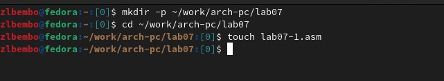{ width=70%}

2) Ввожу в файл lab7-1.asm текст программы из листинга 7.1.

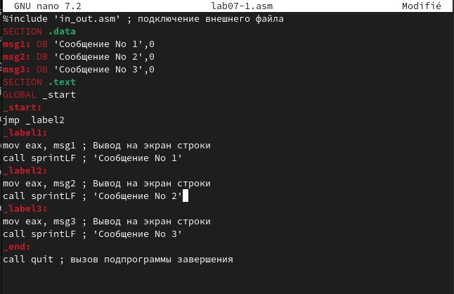{ width=70%}

3) Создаю исполняемый файл и запускаю его

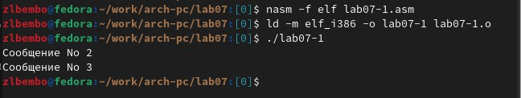{ width=70%}

4) Изменяю текст программы в соответствии с листингом 7.2

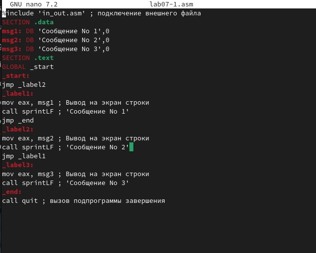{ width=70%}

5) Создаю исполняемый файл и запускаю его

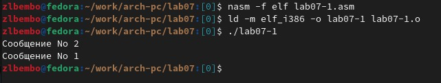{ width=70%}

6) Изменяю текст программы изменив инструкции jmp, чтобы вывод программы был следующим:
Сообщение № 3
Сообщение № 2
Сообщение № 1

```
%include 'in_out.asm' ; подключение внешнего файла
SECTION .data
msg1: DB 'Сообщение № 1',0
msg2: DB 'Сообщение № 2',0
msg3: DB 'Сообщение № 3',0
SECTION .text
GLOBAL _start
_start:
jmp _label3
_label1:
mov eax, msg1 ; Вывод на экран строки
call sprintLF ; 'Сообщение № 1'
jmp _end
_label2:
mov eax, msg2 ; Вывод на экран строки
call sprintLF ; 'Сообщение № 2'
jmp _label1
_label3:
mov eax, msg3 ; Вывод на экран строки
call sprintLF ; 'Сообщение № 3'
jmp _label2
_end:
call quit ; вызов подпрограммы завершения
```

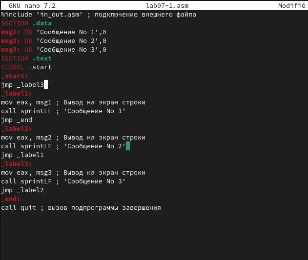{ width=70%}

7) Создаю исполняемый файл и запускаю его

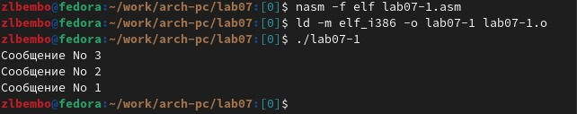{ width=70%}

8) Создаю файл lab7-2.asm и проверяю его создание

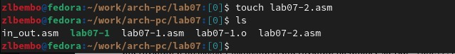{ width=70%}

9) Ввожу в файл текст листинга 7.3, создаю файл и запускаю его

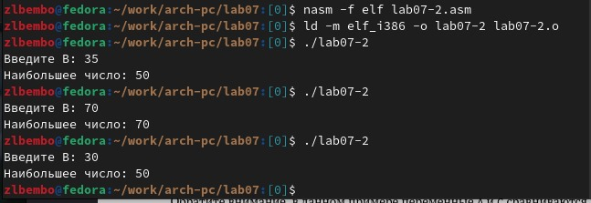{ width=70%}

10) Создаю файл листинга для программы из файла lab7-2.asm и открываю его в текстовом редакторе

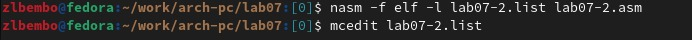{ width=70%}

11) Открытый файл листинга

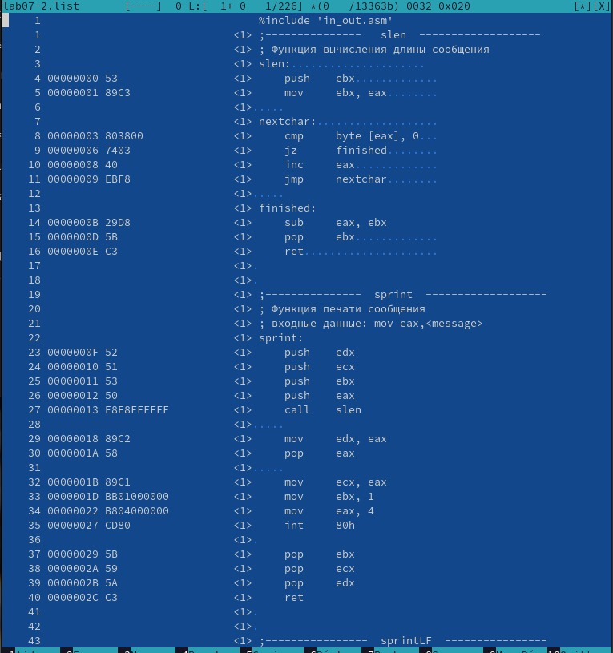{ width=70%}

```

17 000000F2 B9[0A000000] mov ecx,B   
    ( 17 - номер строки,
      000000F2 - адрес, 
      B9 - машинный код, 
      [0A000000] - исходный текст программы
    )
18 000000F7 BA0A000000  mov edx,10   
    ( 18 - номер строки, 
      000000F7 - адрес, 
      BA - машинный код, 
      0A000000 - исходный текст программы
    )
19 000000FC E842FFFFFF call sread   
    ( 19 - номер строки,
      000000FC - адрес,
      E8 - машинный код, 
      42FFFFFF - исходный текст программы
    )
```
12) Копирую файл lab7-2.asm как lab7-2-2.asm и открываю его

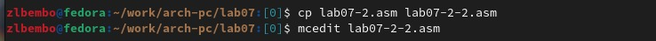{ width=70%}

13) Удаляю один из операндов

{ width=70%}

14) Создаю файл листинга

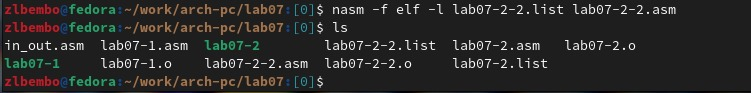{ width=70%}

15) Открытый файл листинга

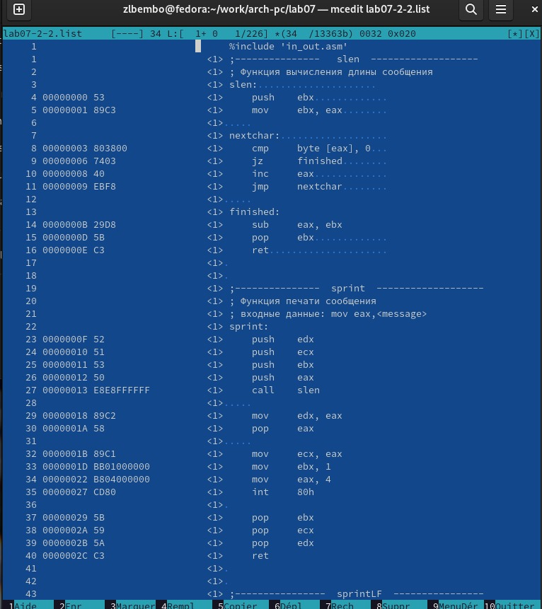{ width=70%}

# Выполнение лабораторной работы

1) Создаю файл для написания программы

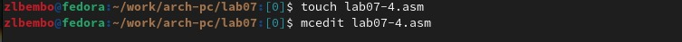{ width=70%}

2) Создание и работа файла. У меня вариант 1

{ width=70%}

Текст файла:

```
%include 'in_out.asm'
section .data
msg2 db "Наименьшее число: ",0h
A dd 17
C dd 23
B dd 45
section .bss
min resb 10
section .text
global _start
_start:
; ---------- Записываем 'A' в переменную 'min'
mov ecx,[A] ; 'ecx = A'
mov [min],ecx ; 'min = A'
; ---------- Сравниваем 'A' и 'С' (как символы)
cmp ecx,[C] ; Сравниваем 'A' и 'С'
jl check_B ; если 'A<C', то переход на метку 'check_B',
mov ecx,[C] ; иначе 'ecx = C'
mov [min],ecx ; 'min = C'
; ---------- Преобразование 'max(A,C)' из символа в число
check_B:
; ---------- Сравниваем 'min(A,C)' и 'B' (как числа)
mov ecx,[min]
cmp ecx,[B] ; Сравниваем 'min(A,C)' и 'B'
jl fin ; если 'min(A,C)<B', то переход на 'fin',
mov ecx,[B] ; иначе 'ecx = B'
mov [min],ecx
; ---------- Вывод результата
fin:
mov eax, msg2
call sprint ; Вывод сообщения 'Наибольшее число: '
mov eax,[min]
call iprintLF ; Вывод 'min(A,B,C)'
call quit ; Выход
```

3) Создаю файл для воторго задания

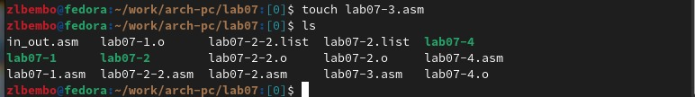{ width=70%}

4) Текст файла

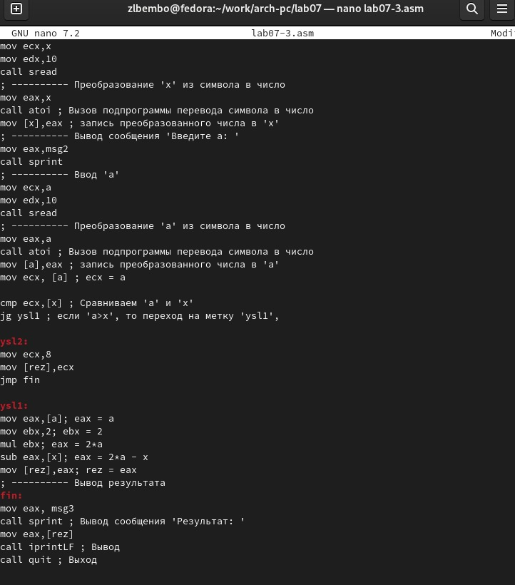{ width=70%}

Текст файла:

```
%include 'in_out.asm'
section .data
msg1 db 'Введите x: ',0h
msg2 db 'Введите a: ',0h
msg3 db "Результат: ",0h
section .bss
a resb 10
x resb 10
rez resb 10
section .text
global _start
_start:
; ---------- Вывод сообщения 'Введите x: '
mov eax,msg1
call sprint
; ---------- Ввод 'x'
mov ecx,x
mov edx,10
call sread
; ---------- Преобразование 'x' из символа в число
mov eax,x
call atoi ; Вызов подпрограммы перевода символа в число
mov [x],eax ; запись преобразованного числа в 'x'
; ---------- Вывод сообщения 'Введите a: '
mov eax,msg2
call sprint
; ---------- Ввод 'a'
mov ecx,a
mov edx,10
call sread
; ---------- Преобразование 'a' из символа в число
mov eax,a
call atoi ; Вызов подпрограммы перевода символа в число
mov [a],eax ; запись преобразованного числа в 'a'
mov ecx, [a] ; ecx = a

cmp ecx,[x] ; Сравниваем 'a' и 'x'
jg ysl1 ; если 'a>x', то переход на метку 'ysl1',

ysl2:
mov ecx,8
mov [rez],ecx
jmp fin

ysl1:
mov eax,[a]; eax = a
mov ebx,2; ebx = 2
mul ebx; eax = 2*a
sub eax,[x]; eax = 2*a - x
mov [rez],eax; rez = eax
; ---------- Вывод результата
fin:
mov eax, msg3
call sprint ; Вывод сообщения 'Результат: '
mov eax,[rez]
call iprintLF ; Вывод
call quit ; Выход
```


5) Работа файла


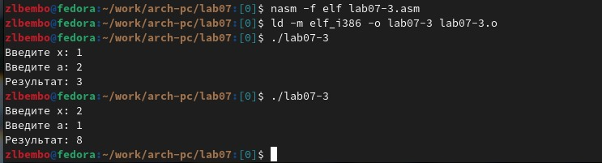{ width=70%}

# Выводы

Мною изумены команды условного и безусловного переходов, приобретены навыки написания программ с использованием переходов, я ознакомилась с назначением и структурой файла листинга.

# Список литературы{.unnumbered}

::: {#refs}
:::


