---
## Front matter
title: "Архитектура компьютера"
subtitle: "Отчёт по лабораторной работе №6"
author: "Ибрахим Мохсейн Алькамаль"

## Generic otions
lang: ru-RU
toc-title: "Содержание"

## Bibliography
bibliography: bib/cite.bib
csl: pandoc/csl/gost-r-7-0-5-2008-numeric.csl

## Pdf output format
toc: true # Table of contents
toc-depth: 2
lof: true # List of figures
lot: true # List of tables
fontsize: 12pt
linestretch: 1.5
papersize: a4
documentclass: scrreprt
## I18n polyglossia
polyglossia-lang:
  name: russian
  options:
	- spelling=modern
	- babelshorthands=true
polyglossia-otherlangs:
  name: english
## I18n babel
babel-lang: russian
babel-otherlangs: english
## Fonts
mainfont: PT Serif
romanfont: PT Serif
sansfont: PT Sans
monofont: PT Mono
mainfontoptions: Ligatures=TeX
romanfontoptions: Ligatures=TeX
sansfontoptions: Ligatures=TeX,Scale=MatchLowercase
monofontoptions: Scale=MatchLowercase,Scale=0.9
## Biblatex
biblatex: true
biblio-style: "gost-numeric"
biblatexoptions:
  - parentracker=true
  - backend=biber
  - hyperref=auto
  - language=auto
  - autolang=other*
  - citestyle=gost-numeric
## Pandoc-crossref LaTeX customization
figureTitle: "Рис."
tableTitle: "Таблица"
listingTitle: "Листинг"
lofTitle: "Список иллюстраций"
lotTitle: "Список таблиц"
lolTitle: "Листинги"
## Misc options
indent: true
header-includes:
  - \usepackage{indentfirst}
  - \usepackage{float} # keep figures where there are in the text
  - \floatplacement{figure}{H} # keep figures where there are in the text
---

# Цель работы

Освоить арифметические инструкции языка ассемблера NASM.

# Задание

1. Создайте каталог для программам лабораторной работы № 6, перейдите в него и создайте файл lab6-1.asm
2. Рассмотрим примеры программ вывода символьных и численных значений. Программы будут выводить значения записанные в регистр eax
3. Далее изменим текст программы и вместо символов, запишем в регистры числа.
4. Как отмечалось выше, для работы с числами в файле in_out.asm реализованы подпрограммы для преобразования ASCII символов в числа и обратно.
5. Аналогично предыдущему примеру изменим символы на числа.
6. В качестве примера выполнения арифметических операций в NASM приведем программу вычисления арифметического выражения.

# Теоретическое введение

Большинство инструкций на языке ассемблера требуют обработки операндов. Адрес операнда предоставляет место, где хранятся данные, подлежащие обработке. Это могут быть
данные хранящиеся в регистре или в ячейке памяти. Далее рассмотрены все существующие
способы задания адреса хранения операндов – способы адресации.
Существует три основных способа адресации:
• Регистровая адресация – операнды хранятся в регистрах и в команде используются
имена этих регистров, например: mov ax,bx.
• Непосредственная адресация – значение операнда задается непосредственно в команде, Например: mov ax,2.
• Адресация памяти – операнд задает адрес в памяти. В команде указывается символическое обозначение ячейки памяти, над содержимым которой требуется выполнить
операцию.
Например, определим переменную intg DD 3 – это означает, что задается область памяти
размером 4 байта, адрес которой обозначен меткой intg. В таком случае, команда
mov eax,[intg]
копирует из памяти по адресу intg данные в регистр eax. В свою очередь команда
mov [intg],eax
запишет в память по адресу intg данные из регистра eax.
Также рассмотрим команду
mov eax,intg
В этом случае в регистр eax запишется адрес intg. Допустим, для intg выделена память начиная с ячейки с адресом 0x600144, тогда команда mov eax,intg аналогична команде mov eax,0x600144 – т.е. эта команда запишет в регистр eax число 0x600144.
6.2.2. Арифметические операции в NASM
6.2.2.1. Целочисленное сложение add.
Схема команды целочисленного сложения add (от англ. addition - добавление) выполняет сложение двух операндов и записывает результат по адресу первого операнда. Команда add работает как с числами со знаком, так и без знака и выглядит следующим образом:
add <операнд_1>, <операнд_2>
Допустимые сочетания операндов для команды add аналогичны сочетаниям операндов для команды mov.
Так, например, команда add eax,ebx прибавит значение из регистра eax к значению из регистра ebx и запишет результат в регистр eax.
Примеры:
add ax,5 ; AX = AX + 5
add dx,cx ; DX = DX + CX
add dx,cl ; Ошибка: разный размер операндов.
6.2.2.2. Целочисленное вычитание sub.
Команда целочисленного вычитания sub (от англ. subtraction – вычитание) работает аналогично команде add и выглядит следующим образом:
sub <операнд_1>, <операнд_2>
Так, например, команда sub ebx,5 уменьшает значение регистра ebx на 5 и записывает результат в регистр ebx.
6.2.2.3. Команды инкремента и декремента.
Довольно часто при написании программ встречается операция прибавления или вычитания единицы. Прибавление единицы называется инкрементом, а вычитание — декрементом.
Для этих операций существуют специальные команды: inc (от англ. increment) и dec (от англ. decrement), которые увеличивают и уменьшают на 1 свой операнд.
Эти команды содержат один операнд и имеет следующий вид:
inc <операнд>
dec <операнд>
Операндом может быть регистр или ячейка памяти любого размера. Команды инкремента и декремента выгодны тем, что они занимают меньше места, чем соответствующие команды сложения и вычитания.
Так, например, команда inc ebx увеличивает значение регистра ebx на 1, а команда inc ax уменьшает значение регистра ax на 1.
6.2.2.4. Команда изменения знака операнда neg.
Еще одна команда, которую можно отнести к арифметическим командам это команда изменения знака neg:
neg <операнд>
Команда neg рассматривает свой операнд как число со знаком и меняет знак операнда на
противоположный. Операндом может быть регистр или ячейка памяти любого размера.
mov ax,1 ; AX = 1
neg ax ; AX = -1
6.2.2.5. Команды умножения mul и imul.
Умножение и деление, в отличии от сложения и вычитания, для знаковых и беззнаковых чисел производиться по-разному, поэтому существуют различные команды.
Для беззнакового умножения используется команда mul (от англ. multiply – умножение):
mul <операнд>
Для знакового умножения используется команда imul:
imul <операнд>
Для команд умножения один из сомножителей указывается в команде и должен находиться в регистре или в памяти, но не может быть непосредственным операндом. Второй сомножитель в команде явно не указывается и должен находиться в регистре EAX,AX или AL, а результат помещается в регистры EDX:EAX, DX:AX или AX, в зависимости от размера операнда 6.1.
Таблица 6.1. Регистры используемые командами умножения в Nasm
Размер операнда Неявный множитель Результат умножения
1 байт AL AX
2 байта AX DX:AX
4 байта EAX EDX:EAX
Пример использования инструкции mul:
a dw 270
mov ax, 100 ; AX = 100
mul a ; AX = AX*a,
mul bl ; AX = AL*BL
mul ax ; DX:AX = AX*AX
6.2.2.6. Команды деления div и idiv.
Для деления, как и для умножения, существует 2 команды div (от англ. divide - деление) и idiv:
div <делитель> ; Беззнаковое деление
idiv <делитель> ; Знаковое деление
В командах указывается только один операнд – делитель, который может быть регистром или ячейкой памяти, но не может быть непосредственным операндом. Местоположение делимого и результата для команд деления зависит от размера делителя. Кроме того, так как в результате деления получается два числа – частное и остаток, то эти числа помещаются в
определённые регистры 6.2.
Таблица 6.2. Регистры используемые командами деления в Nasm
Размер операнда (делителя) Делимое Частное Остаток
1 байт AX AL AH
2 байта DX:AX AX DX
4 байта EDX:EAX EAX EDX
Например, после выполнения инструкций
mov ax,31
mov dl,15
div dl
результат 2 (31/15) будет записан в регистр al, а остаток 1 (остаток от деления 31/15) — в
регистр ah.
Если делитель — это слово (16-бит), то делимое должно записываться в регистрах dx:ax.
Так в результате выполнения инструкций
mov ax,2 ; загрузить в регистровую
mov dx,1 ; пару `dx:ax` значение 10002h
mov bx,10h
div bx
в регистр ax запишется частное 1000h (результат деления 10002h на 10h), а в регистр dx — 2 (остаток от деления).
6.2.3. Перевод символа числа в десятичную символьную запись
Ввод информации с клавиатуры и вывод её на экран осуществляется в символьном виде.
Кодирование этой информации производится согласно кодовой таблице символов ASCII.
ASCII – сокращение от American Standard Code for Information Interchange (Американский стандартный код для обмена информацией). Согласно стандарту ASCII каждый символ кодируется одним байтом.
Расширенная таблица ASCII состоит из двух частей. Первая (символы с кодами 0-127) является универсальной (см. Приложение.), а вторая (коды 128-255) предназначена для специальных символов и букв национальных алфавитов и на компьютерах разных типов может меняться.
Среди инструкций NASM нет такой, которая выводит числа (не в символьном виде). Поэтому, например, чтобы вывести число, надо предварительно преобразовать его цифры в ASCII-коды этих цифр и выводить на экран эти коды, а не само число. Если же выводить число на экран непосредственно, то экран воспримет его не как число, а как последовательность
ASCII-символов – каждый байт числа будет воспринят как один ASCII-символ – и выведет на
экран эти символы.
Аналогичная ситуация происходит и при вводе данных с клавиатуры. Введенные данные будут представлять собой символы, что сделает невозможным получение корректного
результата при выполнении над ними арифметических операций.
Для решения этой проблемы необходимо проводить преобразование ASCII символов в
числа и обратно.
Для выполнения лабораторных работ в файле in_out.asm реализованы подпрограммы
для преобразования ASCII символов в числа и обратно. Это:
• iprint – вывод на экран чисел в формате ASCII, перед вызовом iprint в регистр eax
необходимо записать выводимое число (mov eax,<int>).
• iprintLF – работает аналогично iprint, но при выводе на экран после числа добавляет
к символ перевода строки.
• atoi – функция преобразует ascii-код символа в целое число и записает результат
в регистр eax, перед вызовом atoi в регистр eax необходимо записать число (mov
eax,<int>).

# Выполнение лабораторной работы

1) Создаю каталог для программам лабораторной работы № 6, перехожу в него и
создаю файл lab6-1.asm

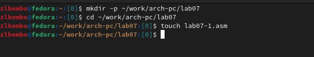{ width=70%}

2.1) Ввожу в файл lab6-1.asm текст программы из листинга 6.1

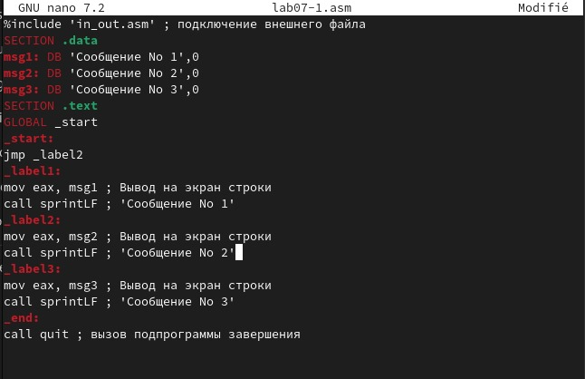{ width=70%}

2.2) Копирую из папки lab5 в папку lab6 файл in_out.asm, проверяю его наличие 

{ width=70%}

2.3) Создаю исполняемый файл и запускаю его. В результате получается j

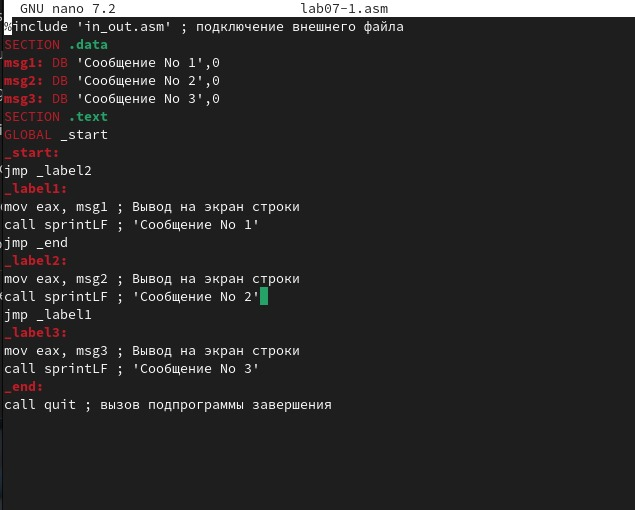{ width=70%}

3.1) Меняю "6" и "4" на 6 и 4 в файле lab6-1.asm

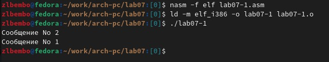{ width=70%}

3.2) Создаю исполняемый файл и запускаю его. В результате получается символ, который не отображается в консоли (спец.LF Возвр. каретки)

{ width=70%}

4.1) Создаю файл lab6-2.asm и проверяю его наличие
 
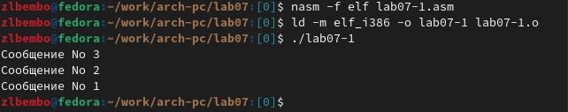{ width=70%}

4.2) Ввожу в файл текст из листинга 6.2

{ width=70%}

4.3) Создаю файл и запускаю его

{ width=70%}

5.1) Заменяю "6" и "4" на 6 и 4 в файле lab6-2.asm

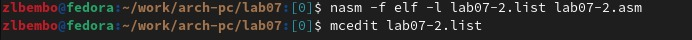{ width=70%}

5.2) Создаю исполняемый файл и запускаю его. В результате получается 10

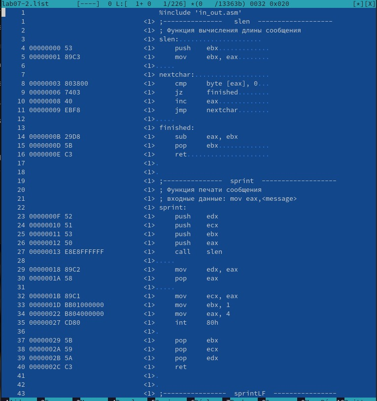{ width=70%}

5.3) Заменяю функцию iprintLF на iprint

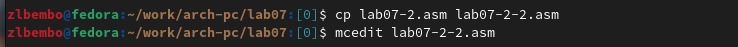{ width=70%}

5.4) Создание и запуск исполняемого файла. Результат такой же, но без переноса строки. Но оно не появилось из-за терминала Kali Linux

{ width=70%}

6.1) Создаю файл lab6-3.asm и проверяю, создан ли он

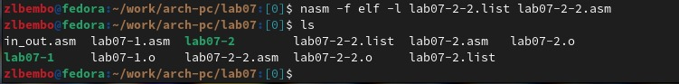{ width=70%}

6.2) Ввожу в файл текст из листинга 6.3, создаю исполняемый файл и запускаю его
 
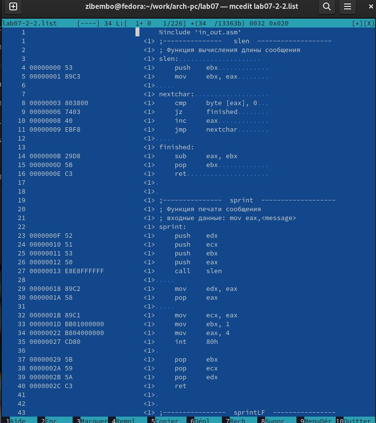{ width=70%}

6.3) Изменяю текст программы так, чтобы она выводила результат выражения (4*6 + 2)/5

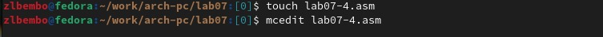{ width=70%}

6.4) Создание и работа исполняемого файла

{ width=70%}

7.1) Создание файла variant.asm

{ width=70%}

7.2) Программа файла

{ width=70%}

7.3) Работа файла

{ width=70%}

7.4) Ответы на вопросы

1. mov eax,rem
   call sprint
2. mov ecx, x - с помощью этой команды мы кладем адрес вводимой строки x в регистр ecx
   mov edx, 80 - с помощью этой команды записыываем в регистр edx длину вводимой строки (80)
   call sread - вызываем подпрограмму из стороннего файла, чтобы обеспечить ввод сообщения с клавиатуры
3. call atoi - подключение сторонней программы, которая преобразует ascii-код символа в целое число и записает результат в регистр eax, перед вызовом atoi в регистр eax необходимо записать число (mov eax,<int>)
4. xor edx,edx
   mov ebx,20
   div ebx
   inc edx
5. В регистр edx
6. Для увеличения значения регистра edx на 1
7. mov eax,edx
   call iprintLF

# Выполнение заданий для самостоятельной работы

1) Создаю файл lab6-4.asm для написания программы по вариантам

{ width=70%}

2) Редактирование файла

{ width=70%}

3) Создание и запуск исполняемого файла. Он выдает верный результат

{ width=70%}


```
%include 'in_out.asm' ; подключение внешнего файла
SECTION .data
div: DB 'Введите значение x: ',0
rem: DB 'Результат: ',0
SECTION .bss
x: RESB 80 ;
SECTION .text
GLOBAL _start
_start:
; ---- Вычисление выражения
mov eax,div ;
call sprint ;
mov ecx, x ;
mov edx, 80 ;
call sread ;
mov eax, x ;
call atoi ;
mov ebx, 8 ;
mul ebx ; eax = x*8
add eax, 6 ; eax = x*2 + 6
mov ebx, 10 ;
mul ebx ; eax = (x*8+10)*10
mov edi,eax ;
; ---- Вывод результата на экран
mov eax,rem ; вызов подпрограммы печати
call sprint ; сообщения 'Результат: '
mov eax,edi ; вызов подпрограммы печати значения
call iprintLF ; из 'edx' (остаток) в виде символов
call quit ; вызов подпрограммы завершения

```


# Выводы

У меня получилось освоить арифметические инструкции языка ассемблера NASM.

# Список литературы{.unnumbered}

::: {#refs}
:::