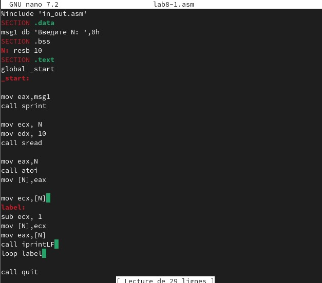

---
## Front matter
title: "Шаблон отчёта по лабораторной работе"
subtitle: "8"
author: "Разанацуа Сара Естэлл"

## Generic otions
lang: ru-RU
toc-title: "Содержание"

## Bibliography
bibliography: bib/cite.bib
csl: pandoc/csl/gost-r-7-0-5-2008-numeric.csl

## Pdf output format
toc: true # Table of contents
toc-depth: 2
lof: true # List of figures
lot: true # List of tables
fontsize: 12pt
linestretch: 1.5
papersize: a4
documentclass: scrreprt
## I18n polyglossia
polyglossia-lang:
  name: russian
  options:
	- spelling=modern
	- babelshorthands=true
polyglossia-otherlangs:
  name: english
## I18n babel
babel-lang: russian
babel-otherlangs: english
## Fonts
mainfont: PT Serif
romanfont: PT Serif
sansfont: PT Sans
monofont: PT Mono
mainfontoptions: Ligatures=TeX
romanfontoptions: Ligatures=TeX
sansfontoptions: Ligatures=TeX,Scale=MatchLowercase
monofontoptions: Scale=MatchLowercase,Scale=0.9
## Biblatex
biblatex: true
biblio-style: "gost-numeric"
biblatexoptions:
  - parentracker=true
  - backend=biber
  - hyperref=auto
  - language=auto
  - autolang=other*
  - citestyle=gost-numeric
## Pandoc-crossref LaTeX customization
figureTitle: "Рис."
tableTitle: "Таблица"
listingTitle: "Листинг"
lofTitle: "Список иллюстраций"
lotTitle: "Список таблиц"
lolTitle: "Листинги"
## Misc options
indent: true
header-includes:
  - \usepackage{indentfirst}
  - \usepackage{float} # keep figures where there are in the text
  - \floatplacement{figure}{H} # keep figures where there are in the text
---

# Цель работы

- Приобретение навыков написания программ с использованием циклов и обработкой аргументов командной строки.

# Задание

- Реализация циклов в NASM.

- Обработка аргументов командной строки.

- Задание для самостоятельной работы.

# Теоретическое введение

- Стек — это структура данных, организованная по принципу LIFO («Last In — First Out» или «последним пришёл — первым ушёл»). Стек является частью архитектуры процессора и реализован на аппаратном уровне. Для работы со стеком в процессоре есть специальные регистры (ss, bp, sp) и команды. Основной функцией стека является функция сохранения адресов возврата и передачи аргументов при вызове процедур. Кроме того, в нём выделяется память для локальных переменных и могут временно храниться значения регистров. Стек имеет вершину, адрес последнего добавленного элемента, который хранится в регистре esp (указатель стека). Противоположный конец стека называется дном. Значение, помещённое в стек последним, извлекается первым. При помещении значения в стек указатель стека уменьшается, а при извлечении — увеличивается.

- Команда push размещает значение в стеке, т.е. помещает значение в ячейку памяти, на которую указывает регистр esp, после этого значение регистра esp увеличивается на 4. Данная команда имеет один операнд — значение, которое необходимо поместить в стек.

- Команда pop извлекает значение из стека, т.е. извлекает значение из ячейки памяти, на которую указывает регистр esp, после этого уменьшает значение регистра esp на 4. У этой команды также один операнд, который может быть регистром или переменной в памяти. Нужно помнить, что извлечённый из стека элемент не стирается из памяти и остаётся как “мусор”, который будет перезаписан при записи нового значения в стек.

- Для организации циклов существуют специальные инструкции. Для всех инструкций максимальное количество проходов задаётся в регистре ecx. Наиболее простой является инструкция loop. Она позволяет организовать безусловный цикл.

# Выполнение лабораторной работы

## Реализация циклов в NASM.

<<<<<<< HEAD
- Создаю каталог для программ лабораторной работы № 8, перехожу в него и создаю файл lab8-1.asm.(рис.[@fig:001]).

{#fig:001 width=100%}

- Ввожу в файл lab8-1.asm текст программы из листинга 8.1. (рис.[@fig:002]).

{#fig:002 width=100%}

- Создаю исполняемый файл и проверяю его работу. (рис.[@fig:003]).

{#fig:003 width=100%}

- Изменяю текст программы, добавив изменение значения регистра ecx в цикле. (рис.[@fig:004]).

{#fig:004 width=100%}

- Создаю исполняемый файл и проверяю его работу. (рис.[@fig:005]).

{#fig:005 width=100%}

- Вношу изменения в текст программы, добавив команды push и pop для сохранения значения счетчика цикла loop. (рис. [@fig:006]).

{#fig:006 width=100%}

- Создаю исполняемый файл и проверяю его работу. (рис.[@fig:007]).
=======
- Создаю каталог для программ лабораторной работы № 8, перехожу в него и создаю файл lab8-1.asm.(рис. @fig:001).

{#fig:001 width=100%}

- Ввожу в файл lab8-1.asm текст программы из листинга 8.1. (рис. @fig:002).

{#fig:002 width=100%}

- Создаю исполняемый файл и проверяю его работу. (рис. @fig:003).

{#fig:003 width=100%}

- Изменяю текст программы, добавив изменение значения регистра ecx в цикле. (рис. @fig:004).

{#fig:004 width=100%}

- Создаю исполняемый файл и проверяю его работу. (рис. @fig:005).

{#fig:005 width=100%}

- Вношу изменения в текст программы, добавив команды push и pop для сохранения значения счетчика цикла loop. (рис. @fig:006).

{#fig:006 width=100%}

- Создаю исполняемый файл и проверяю его работу. (рис. @fig:007).
>>>>>>> a46dfcd33f5a6da611c76fecfb17de6381152f50

{#fig:007 width=100%}

## Обработка аргументов командной строки.
 
<<<<<<< HEAD
- На этом шаге мы создали файл lab8-2.asm, затем заполнили в нем наш код. (рис.[@fig:008]).

{#fig:008 width=100%}

- Создаю исполняемый файл и запускаю его, указав нужные аргументы. (рис.[@fig:009]).
=======
- На этом шаге мы создали файл lab8-2.asm, затем заполнили в нем наш код. (рис. @fig:008).

{#fig:008 width=100%}

- Создаю исполняемый файл и запускаю его, указав нужные аргументы. (рис. @fig:009).
>>>>>>> a46dfcd33f5a6da611c76fecfb17de6381152f50

{#fig:009 width=100%}

- И, как вы можете видеть, на этот раз при запуске программы мы добавили в команду три аргумента, и в этом случае были обработаны три аргумента

<<<<<<< HEAD
- Первым делом мы создали файл lab8-3.asm, затем заполнили кодом программы. (рис.[@fig:010]).

{#fig:010 width=100%}

- Создаю исполняемый файл и запускаю его, указав аргументы.(рис.[@fig:011]).

{#fig:011 width=100%}

- Изменяю текст программы из листинга 8.3 для вычисления произведения аргументов командной строки. (рис.[@fig:012]).

{#fig:012 width=100%}

- Создаю исполняемый файл и запускаю его, указав аргументы. (рис.[@fig:013]).
=======
- Первым делом мы создали файл lab8-3.asm, затем заполнили кодом программы. (рис. @fig:010).

{#fig:010 width=100%}

- Создаю исполняемый файл и запускаю его, указав аргументы.(рис. @fig:011).

{#fig:011 width=100%}

- Изменяю текст программы из листинга 8.3 для вычисления произведения аргументов командной строки. (рис. @fig:012).

{#fig:012 width=100%}

- Создаю исполняемый файл и запускаю его, указав аргументы. (рис. @fig:013).
>>>>>>> a46dfcd33f5a6da611c76fecfb17de6381152f50

{#fig:013 width=100%}

## Задание для самостоятельной работы.

- В этой части мы должны были написать программу,которая находит сумму значений функции f(x) для x = x1, x2, ..., xn

<<<<<<< HEAD
- сначала мы создали наш файл lab8-4.asm, где будет находиться наш код, затем мы написали программу. (рис.[@fig:014]).

{#fig:014 width=100%} 

- Создаю исполняемый файл и проверьте его работу на нескольких наборах x = x1, x2, ..., xn. (рис.[@fig:015]).
=======
- сначала мы создали наш файл lab8-4.asm, где будет находиться наш код, затем мы написали программу. (рис. @fig:014).

{#fig:014 width=100%} 

- Создаю исполняемый файл и проверьте его работу на нескольких наборах x = x1, x2, ..., xn. (рис. @fig:015).
>>>>>>> a46dfcd33f5a6da611c76fecfb17de6381152f50

{#fig:015 width=100%}

# Выводы

- Благодаря этой лабораторной работе мы научились писать программы с использованием циклов и обработки аргументов командной строки, что поможет нам в дальнейшей лабораторной работе.

# Список литературы{.unnumbered}

::: {#refs} :::

