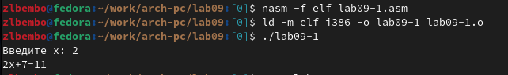
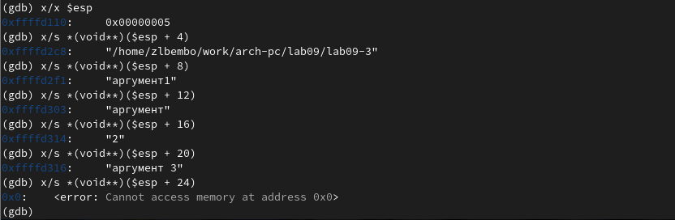

---
## Front matter
title: "Шаблон отчёта по лабораторной работе"
subtitle: "9"
author: "Разанацуа Сара Естэлл"

## Generic otions
lang: ru-RU
toc-title: "Содержание"

## Bibliography
bibliography: bib/cite.bib
csl: pandoc/csl/gost-r-7-0-5-2008-numeric.csl

## Pdf output format
toc: true # Table of contents
toc-depth: 2
lof: true # List of figures
lot: true # List of tables
fontsize: 12pt
linestretch: 1.5
papersize: a4
documentclass: scrreprt
## I18n polyglossia
polyglossia-lang:
  name: russian
  options:
	- spelling=modern
	- babelshorthands=true
polyglossia-otherlangs:
  name: english
## I18n babel
babel-lang: russian
babel-otherlangs: english
## Fonts
mainfont: PT Serif
romanfont: PT Serif
sansfont: PT Sans
monofont: PT Mono
mainfontoptions: Ligatures=TeX
romanfontoptions: Ligatures=TeX
sansfontoptions: Ligatures=TeX,Scale=MatchLowercase
monofontoptions: Scale=MatchLowercase,Scale=0.9
## Biblatex
biblatex: true
biblio-style: "gost-numeric"
biblatexoptions:
  - parentracker=true
  - backend=biber
  - hyperref=auto
  - language=auto
  - autolang=other*
  - citestyle=gost-numeric
## Pandoc-crossref LaTeX customization
figureTitle: "Рис."
tableTitle: "Таблица"
listingTitle: "Листинг"
lofTitle: "Список иллюстраций"
lotTitle: "Список таблиц"
lolTitle: "Листинги"
## Misc options
indent: true
header-includes:
  - \usepackage{indentfirst}
  - \usepackage{float} # keep figures where there are in the text
  - \floatplacement{figure}{H} # keep figures where there are in the text
---

# Цель работы

- Приобретение навыков написания программ с использованием подпрограмм. Знакомство
с методами отладки при помощи GDB и его основными возможностями.

# Задание

- 1. Реализация подпрограмм в NASM.

- 2. Отладка программам с помощью GDB.

- 3. Добавление точек останова.

- 4. Работа с данными программы в GDB.

- 5. Обработка аргументов командной строки в GDB.

- 6. Задания для самостоятельной работы.

# Выполнение лабораторной работы

## Реализация подпрограмм в NASM.

- Создаю каталог для выполнения лабораторной работы № 9, перехожу в него и создаю файл lab09-1.asm. (рис. [@fig:001]).

{#fig:001 width=100%}

- Ввожу в файл lab09-1.asm текст программы с использованием подпрограммы из листинга 9.1. (рис. [@fig:002]).

{#fig:002 width=100%}

- Создаю исполняемый файл и проверяю его работу. (рис. [@fig:003]).

{#fig:003 width=100%}

- Изменяю текст программы, добавив подпрограмму _subcalcul в подпрограмму _calcul для вычисления выражения f(g(x)), где x вводится с клавиатуры, f(x) = 2x + 7, g(x) = 3x − 1.(рис. [@fig:004]).

{#fig:004 width=100%}

- Создаю исполняемый файл и проверяю его работу. (рис. [@fig:005]).

{#fig:005 width=100%}

## Отладка программам с помощью GDB.

- На этом шаге мы создали файл lab09-2.asm с текстом программы из ли- стинга 9.2. (рис. [@fig:026]).

{#fig:026 width=100%}

- Получаю исполняемый файл для работы с GDB с ключом ‘-g’. (рис. [@fig:006]).

{#fig:006 width=100%}

- Загружаю исполняемый файл в отладчик gdb.(рис. [@fig:007]).

{#fig:007 width=100%}

- Проверяю работу программы, запустив ее в оболочке GDB с помощью команды run. (рис. [@fig:008]).

{#fig:008 width=100%}

- Для более подробного анализа программы устанавливаю брейкпоинт на метку _start и запускаю её.(рис. [@fig:009]).

{#fig:009 width=100%}

- Просматриваю дисассимилированный код программы с помощью команды disassemble, начиная с метки _start, и переключаюсь на отображение команд с синтаксисом Intel, введя команду set disassembly-flavor intel.(рис. [@fig:010]).

{#fig:010 width=100%} 

- Разница в синтаксисе между AT&T и INTEL заключается в том, что AT&T использует синтаксис mov $0x4,%eax, который популярен среди пользова- телей Linux, с другой стороны, INTEL использует синтаксис mov eax,0x4 , который является популярен среди пользователей Windows.

- Включаю режим псевдографики для более удобного анализа программы с помощью команд layout asm и layout regs.(рис. [@fig:011]).

{#fig:011 width=100%} 

## Добавление точек останова.

- Проверяю, что точка останова по имени метки _start установлена с помощью команды info breakpoints и устанавливаю еще одну точку останова по адресу инструкции mov ebx,0x0. Просматриваю информацию о всех установленных точках останова.(рис. [@fig:012]).

{#fig:012 width=100%} 

## Работа с данными программы в GDB.

- Выполняю 5 инструкций с помощью команды stepi и слежу за изменением значений регистров. (рис. [@fig:013]).

{#fig:013 width=100%} 

(рис. [@fig:014]).

{#fig:014 width=100%} 

- Просматриваю значение переменной msg1 по имени с помощью команды x/1sb &msg1 и значение переменной msg2 по ее адресу.(рис. [@fig:015]).

{#fig:015 width=100%} 

- С помощью команды set изменяю первый символ переменной msg1 и заменяю первый символ в переменной msg2.(рис. [@fig:016]).

{#fig:016 width=100%} 

- Вывожу в шестнадцатеричном формате, в двоичном формате и в символьном виде соответственно значение регистра edx с помощью команды print p/F $val. (рис. [@fig:017]).

{#fig:017 width=100%} 

- С помощью команды set изменяю значение регистра ebx в соответствии с заданием. (рис. [@fig:018]).

{#fig:018 width=100%}

- Разница вывода команд p/s $ebx отличается тем, что в первом случае мы переводим символ в его строковый вид, а во втором случае число в строковом виде не изменяется.

- Завершаю выполнение программы с помощью команды continue и выхожу из GDB с помощью команды quit.(рис. [@fig:019]).

{#fig:019 width=100%} 

## Обработка аргументов командной строки в GDB.

- Копирую файл lab8-2.asm с программой из листинга 8.2 в файл с именем lab09-3.asm и создаю исполняемый файл. (рис. [@fig:020]).

{#fig:020 width=100%} 

- Загружаю исполняемый файл в отладчик gdb, указывая необходимые аргументы с использованием ключа --args.(рис. [@fig:021]).

{#fig:021 width=100%}

- Устанавливаю точку останова перед первой инструкцией в программе и запускаю ее.(рис. [@fig:022]).

{#fig:022 width=100%}

- Посматриваю вершину стека и позиции стека по их адресам. (рис. [@fig:023]).

{#fig:023 width=100%}

## Задания для самостоятельной работы.

- 1) Преобразовываю программу из лабораторной работы №8 (Задание №1 для самостоятельной работы), реализовав вычисление значения функции f(x) как подпрограмму.
- Запускаю код и проверяю, что она работает корректно. (рис. [@fig:024]).

{#fig:024 width=100%}

- 2) Ввожу в файл task1.asm текст программы из листинга 9.3
- При корректной работе программы должно выводится "25". Создаю исполняемый файл и запускаю его.(рис. [@fig:025]).

{#fig:025 width=100%}

# Выводы

- Во время выполнения данной лабораторной работы я приобрела навыки написания программ с использованием подпрограмм и ознакомилась с методами отладки при помощи GDB и его основными возможностями.

# Список литературы{.unnumbered}

1. GDB: The GNU Project Debugger. — URL: https://www.gnu.org/software/gdb/.
2. GNU Bash Manual. — 2016. — URL: https://www.gnu.org/software/bash/manual/.
3. Midnight Commander Development Center. — 2021. — URL: https://midnight-commander.
org/.
4. NASM Assembly Language Tutorials. — 2021. — URL: https://asmtutor.com/.
5. Newham C. Learning the bash Shell: Unix Shell Programming. — O’Reilly Media, 2005. —
354 с. — (In a Nutshell). — ISBN 0596009658. — URL: http://www.amazon.com/Learning-
bash-Shell-Programming-Nutshell/dp/0596009658.
6. Robbins A. Bash Pocket Reference. — O’Reilly Media, 2016. — 156 с. — ISBN 978-1491941591.
7. The NASM documentation. — 2021. — URL: https://www.nasm.us/docs.php.
8. Zarrelli G. Mastering Bash. — Packt Publishing, 2017. — 502 с. — ISBN 9781784396879.
9. Колдаев В. Д., Лупин С. А. Архитектура ЭВМ. — М. : Форум, 2018.
10. Куляс О. Л., Никитин К. А. Курс программирования на ASSEMBLER. — М. : Солон-Пресс,
2017.
11. Новожилов О. П. Архитектура ЭВМ и систем. — М. : Юрайт, 2016.
12. Расширенный ассемблер: NASM. — 2021. — URL: https://www.opennet.ru/docs/RUS/nasm/.
13. Робачевский А., Немнюгин С., Стесик О. Операционная система UNIX. — 2-е изд. — БХВ-
Петербург, 2010. — 656 с. — ISBN 978-5-94157-538-1.
14. Столяров А. Программирование на языке ассемблера NASM для ОС Unix. — 2-е изд. —
М. : МАКС Пресс, 2011. — URL: http://www.stolyarov.info/books/asm_unix.
15. Таненбаум Э. Архитектура компьютера. — 6-е изд. — СПб. : Питер, 2013. — 874 с. —
(Классика Computer Science).
16. Таненбаум Э., Бос Х. Современные операционные системы. — 4-е изд. — СПб. : Питер,
2015. — 1120 с. — (Классика Computer Science).
