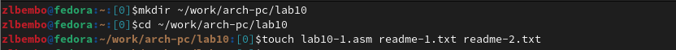
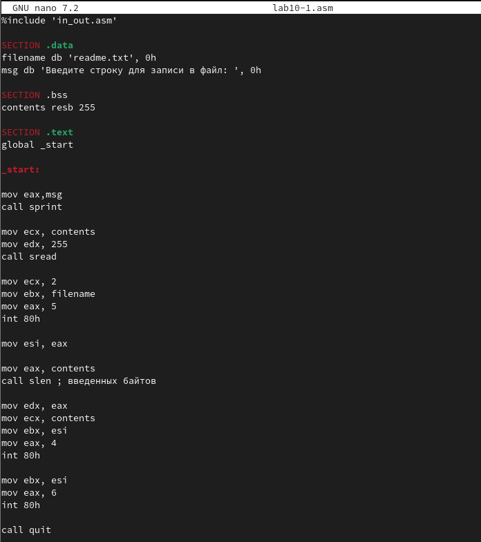
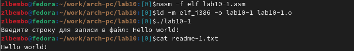
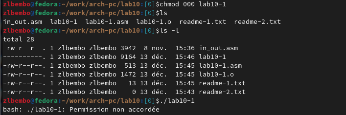
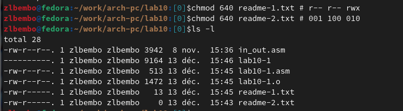
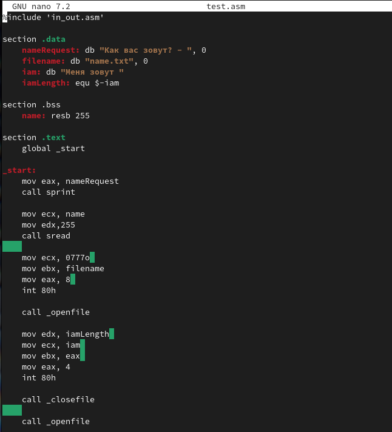
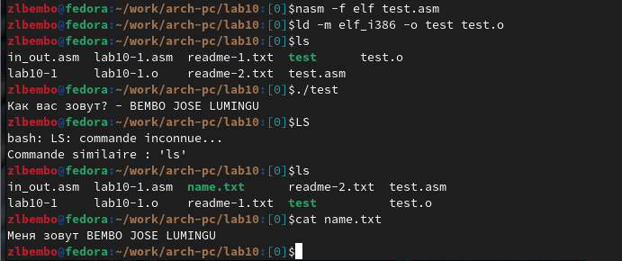

---
## Front matter
title: "Шаблон отчёта по лабораторной работе"
subtitle: "10"
author: "Разанацуа Сара Естэлл"

## Generic otions
lang: ru-RU
toc-title: "Содержание"

## Bibliography
bibliography: bib/cite.bib
csl: pandoc/csl/gost-r-7-0-5-2008-numeric.csl

## Pdf output format
toc: true # Table of contents
toc-depth: 2
lof: true # List of figures
lot: true # List of tables
fontsize: 12pt
linestretch: 1.5
papersize: a4
documentclass: scrreprt
## I18n polyglossia
polyglossia-lang:
  name: russian
  options:
	- spelling=modern
	- babelshorthands=true
polyglossia-otherlangs:
  name: english
## I18n babel
babel-lang: russian
babel-otherlangs: english
## Fonts
mainfont: PT Serif
romanfont: PT Serif
sansfont: PT Sans
monofont: PT Mono
mainfontoptions: Ligatures=TeX
romanfontoptions: Ligatures=TeX
sansfontoptions: Ligatures=TeX,Scale=MatchLowercase
monofontoptions: Scale=MatchLowercase,Scale=0.9
## Biblatex
biblatex: true
biblio-style: "gost-numeric"
biblatexoptions:
  - parentracker=true
  - backend=biber
  - hyperref=auto
  - language=auto
  - autolang=other*
  - citestyle=gost-numeric
## Pandoc-crossref LaTeX customization
figureTitle: "Рис."
tableTitle: "Таблица"
listingTitle: "Листинг"
lofTitle: "Список иллюстраций"
lotTitle: "Список таблиц"
lolTitle: "Листинги"
## Misc options
indent: true
header-includes:
  - \usepackage{indentfirst}
  - \usepackage{float} # keep figures where there are in the text
  - \floatplacement{figure}{H} # keep figures where there are in the text
---

# Цель работы

- Приобретение навыков написания программ для работы с файлами.

# Задание

- 1) Написание программ для работы с файлами.

- 2) Задание для самостоятельной работы.

# Выполнение лабораторной работы

## Написание программ для работы с файлами.

- Создаю каталог для программ лабораторной работы № 10, перехожу в него и создаю файлы lab10-1.asm, readme-1.txt и readme-2.txt. (рис. [@fig:001]).

{#fig:001 width=100%}

- Ввожу в файл lab10-1.asm текст программы, записывающей в файл сообщения, из листинга 10.1.(рис. [@fig:002]).

{#fig:002 width=100%}

- Создаю исполняемый файл и проверяю его работу.(рис. [@fig:003]).

{#fig:003 width=100%}

- Используя команду chmod, мы изменили права доступа к исполняемому файлу lab11-1, запретив его выполнение.(рис. [@fig:004]).

{#fig:004 width=100%}

- После этого мы попытались запустить исполняемый файл, но без каких- либо результатов, и это потому, что у нас нет доступа для чтения этого файла.

- На этом шаге мы предоставили доступ к файлу readme1.txt в соответствии с имеющимся у нас вариантом. (рис. [@fig:005]).

{#fig:005 width=100%}

## Задание для самостоятельной работы.

- Пишу код программы, выводящей приглашения “Как Вас зовут?”, считывающей с клавиатуры фамилию и имя и создающую файл, в который записывается сообщение “Меня зовут "ФИ"”.(рис. [@fig:006]).

{#fig:006 width=100%}

- Создаю исполняемый файл и проверяю его работу. Проверяю наличие файла и его содержимое с помощью команд ls и cat. (рис. [@fig:007]).

{#fig:007 width=100%}

# Выводы

- На этой работе, я приобрел навыки написания программ для работы с файлами.

# Список литературы{.unnumbered}

1. GDB: The GNU Project Debugger. — URL: https://www.gnu.org/software/gdb/.
2. GNU Bash Manual. — 2016. — URL: https://www.gnu.org/software/bash/manual/.
3. Midnight Commander Development Center. — 2021. — URL: https://midnight-commander.
org/.
4. NASM Assembly Language Tutorials. — 2021. — URL: https://asmtutor.com/.
5. Newham C. Learning the bash Shell: Unix Shell Programming. — O’Reilly Media, 2005. —
354 с. — (In a Nutshell). — ISBN 0596009658. — URL: http://www.amazon.com/Learning-
bash-Shell-Programming-Nutshell/dp/0596009658.
6. Robbins A. Bash Pocket Reference. — O’Reilly Media, 2016. — 156 с. — ISBN 978-1491941591.
7. The NASM documentation. — 2021. — URL: https://www.nasm.us/docs.php.
8. Zarrelli G. Mastering Bash. — Packt Publishing, 2017. — 502 с. — ISBN 9781784396879.
9. Колдаев В. Д., Лупин С. А. Архитектура ЭВМ. — М. : Форум, 2018.
10. Куляс О. Л., Никитин К. А. Курс программирования на ASSEMBLER. — М. : Солон-Пресс,
2017.
11. Новожилов О. П. Архитектура ЭВМ и систем. — М. : Юрайт, 2016.
12. Расширенный ассемблер: NASM. — 2021. — URL: https://www.opennet.ru/docs/RUS/nasm/.
13. Робачевский А., Немнюгин С., Стесик О. Операционная система UNIX. — 2-е изд. — БХВ-
Петербург, 2010. — 656 с. — ISBN 978-5-94157-538-1.
14. Столяров А. Программирование на языке ассемблера NASM для ОС Unix. — 2-е изд. —
М. : МАКС Пресс, 2011. — URL: http://www.stolyarov.info/books/asm_unix.
15. Таненбаум Э. Архитектура компьютера. — 6-е изд. — СПб. : Питер, 2013. — 874 с. —
(Классика Computer Science).
16. Таненбаум Э., Бос Х. Современные операционные системы. — 4-е изд. — СПб. : Питер,
2015. — 1120 с. — (Классика Computer Science).
